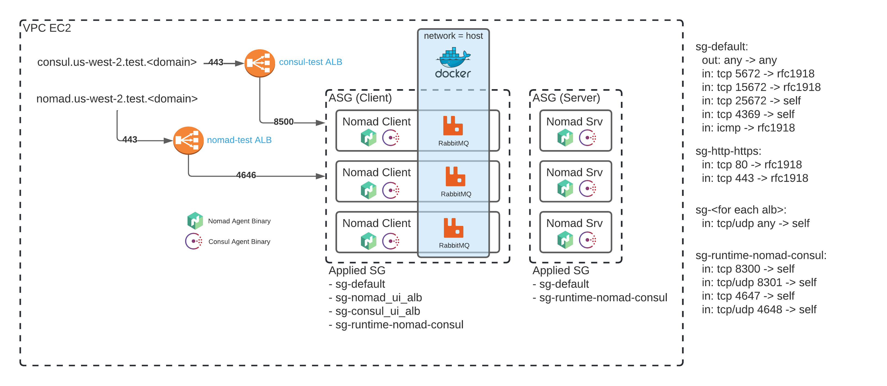

# Security
THIS DEPLOYMENT IS WIDLY INSECURE and is not intended to be deployed to any publicly accessable VPC.

No, seriously.. nothing is secure... Nomad, Consul, RabbitMQ... its all wide open... but it does use TLS at least :P

# Quickstart
## Manual AWS Requirements
- An AWS VPC, note your VPC ID (Formatted as vpc-1234abcd)
- An AWS Route53 DNS Zone, note your zone ID (Formatted as ABCD1234)
- SSH Key Pair: You need to have an SSH Key pair, note the name
  - https://docs.aws.amazon.com/ground-station/latest/ug/create-ec2-ssh-key-pair.html
- An AWS Security Group to supply to Packer for AMI Creation. This can be a simple Any/Any allow, since its only used for the instance created to pack the AMI, then the instance is destroyed.
- Add the tag `Environment = "test"` to any subnets in your VPC that should be used for Packer and Terraform. This is dynamically discovered in two places:
  - `./terraform/aws/data.tf`
  - `./packer/nomad-{server|client}-ubuntu-focal/build.pkr.hcl`

## Start
```bash
git clone git@github.com:namachieli/hashistack-rabbitmq-discussion-4229.git
cd hashistack-rabbitmq-discussion-4229
```

## Packer to build AMIs

### ENV Vars for Packer
```bash
export PKR_VAR_gossip_key="$(openssl rand -base64 32)"
export PKR_VAR_ec2_sg_id=""
export PKR_VAR_vpc_id=""
```
- **PKR_VAR_gossip_key** Nomad and Consul use simple symmetrical encryption for the gossip protocol, 32 byte base 64 encoded string
- **PKR_VAR_ec2_sg_id** SG ID that Packer uses create the AMI (can just be an any/any since its only for while packer packs)
- **PKR_VAR_vpc_id** The ID of your VPC

You will see big blocks of red errors, if the errors are related to either: debconf, apt, or dpkg you can ignore them

### Build Nomad/Consul Server Node AMI with Packer
```bash
cd ./packer/nomad-server-ubuntu-focal
packer build .
```
Note the AMI id created (format `ami-abcd1234`)

### Build Nomad/Consul Client Node AMI with Packer
```bash
cd ../nomad-client-ubuntu-focal
packer build .
```
Note the AMI id created (format `ami-abcd1234`)

## Deploy Infra with Terraform

```
cd ../../terraform
```

### ENV Vars for Terraform

Use the outputted AMI ids from Packer (format `ami-abcd1234`), and use them accordingly below

```bash
export TF_VAR_runtime_server_ami_id=""
export TF_VAR_runtime_client_ami_id=""
export TF_VAR_ssh_key_name=""
export TF_VAR_vpc_ids='{"us-west-2.test" = "<VPC ID>"}'
export TF_VAR_r53_zone_id=""
```
- **TF_VAR_runtime_server_ami_id** The AMI created by Packer for 'Server'
- **TF_VAR_runtime_client_ami_id** The AMI created by Packer for 'Client'
- **TF_VAR_ssh_key_name** The name of the SSH key (that exists in your account manually) that will be placed on launched instances
- **TF_VAR_vpc_ids** Used in a map lookup, hence the formatting. The ID of your VPC
- **TF_VAR_r53_zone_id** The id of the Route53 Zone that DNS records are created in (Required to create certificates)

#### Note
The Security Groups that are created statically only allow a source of RFC1918. If you need to build this in a public VPC, or whitelist from spcific public addresses, you need to modify the entries found in `./terraform/aws/modules/{sg-*}/main.tf` and also in `./terraform/aws/modules/https-alb/sg.tf`.

### Terraform init -> plan -> apply
```bash
terraform init
terraform plan
terraform apply
```

## Nomad Job / RabbitMQ

### Access Nomad
You probably need to give it a couple minutes for Auto Scaling Groups (ASG) to spin up, instances to self provision, etc. Usually only takes a few minutes.

Browse to `https://nomad.us-west-2.test.<your domain>/`

Click on "Run Job" in the upper right

Copy/Paste contents of `./nomad/rabbitmq.nomad`. Plan, review, apply

Consul is available at `https://consul.us-west-2.test.<your domain>/`. You will see the service for rabbitmq appear once nodes check in

### Access RabbitMQ Containers
Navigate to
- `Jobs` >
- `rabbitmq` >
- `(center of page) Task Groups: cluster` >
-  `select a node` >

In the upper right, click `Exec`. A Pop-up will open as a console to the container.

### RabbitMQ Logs from Daemon running containers
Navigate to
- `Jobs` >
- `rabbitmq` >
- `(center of page) Task Groups: cluster` >
-  `select a node` >
-  `(center of page) Tasks: rabbitmq` >
- `(top of page) Logs`

You will now be able to see a stream of `stdout` and `stderr` for the rabbitmq process

### Access RabbitMQ UI
Because docker is using host networking and Nomad was set to assign static port mapping, you can access the RabbitMQ Ui on any 'Client' node directly at `ip_addr:15672` with the user/pass set in the nomad job spec (default is test/test)

# Diagram
Because any pictures are better than no pictures


